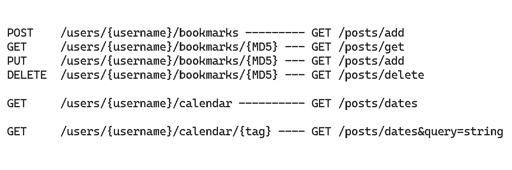
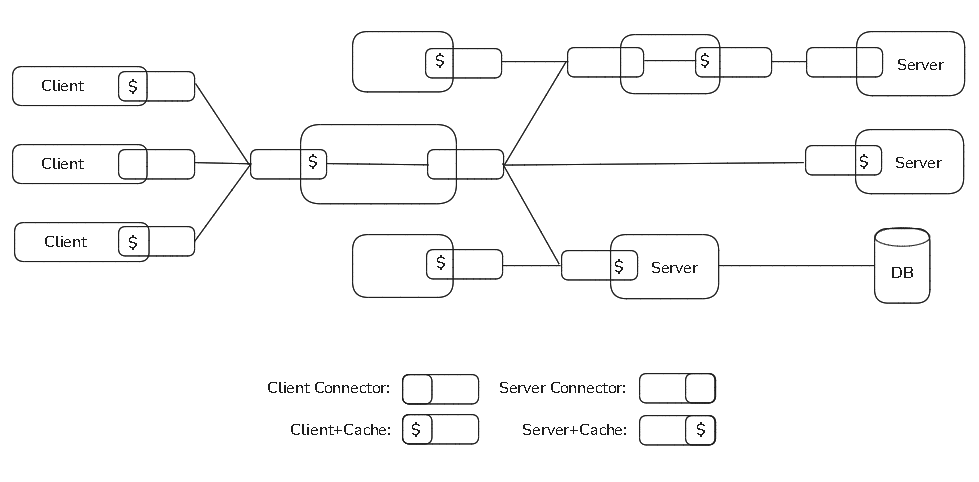

Title: Understanding REST APIs
Date: 2024-07-22
Modified: 2024-07-22
Category: Articles
Tags: software engineering, api
Slug: understanding-rest-apis
Authors: Juan José Farina
Summary: Are you a master of REST APIs? Check this article where I delve into the origins of REST APIs, their structure, and how they work.

---

## Starting with the basics

First things first: API means `Application Programming Interface`. It's a set of rules and protocols for building and interacting with software applications. It's essentially an exposed communication protocol so external systems can make an application return either data or execute some functionality.

That was very formal, let's break it down: suppose you have a data structure of an `array` and you don't know its contents. Something like: `[?, ?, ?, ?, ?...]`, where you don't even know how many elements are in the array, nor can community in any way.

An API would be a `means for you to communicate with the array`, for instance, retrieving the length of the array, retrieving an item at certain index, or sorting the array. And yes, all those methods and properties that you use in your every day programming language, are APIs of the data structures that you are using.

But, when we are talking about REST APIs, we are not talking about any kind of API, but specifically Web APIs, or HTTP APIs.

## But, what is HTTP?

`Hypertext Transfer Protocol (HTTP)` is the foundation of any data exchange on the Web and a protocol used for transmitting hypermedia documents, such as HTML. It was designed for communication between web browsers and web servers, but it can also be used for other purposes.

HTTP is an `application layer protocol` that most commonly make use of `TCP/IP`, a four layers model for network communication between devices. Here is a short GIF on how the data flow works:

<p align="center">
  
</p>

We won't delve into the more complex technicalities of such low-level communication protocols, but just do know that HTTP relies on these lower-level layers. Let's keep talking about HTTP. A typical request or response consists vaguely of two things:

- **Headers**: additional information about the request or response.
- **Body**: the actual data being transferred.

Requests also have a method, which is the action that the client wants to perform on the server. The most common methods are:

- **GET**: Retrieve an existing resource using a URI. This could be anything, and it's what is commonly done when browsing the web: retrieving HTML, CSS, etc. `GET has no body`.

*(this method exists since the first public version of HTTP/0.9 of 1991)*

- **POST**: Send data to a server. This was the method to create a resource or ask the server to perform an action. Basically, anything that wasn't a "retrieve operation" (a `GET` operation), used to be a `POST` operation.
- **PUT**: Put a resource in a specific URI. This is usually used for updating an existing resource, though it can be used to create a new resource too.
- **DELETE**: Delete an existing resource at a specific URI.

*(these methods, among others, were introduced in HTTP/1.0 of 1996)*

- **PATCH**: This updates an existing resource partially.

*(this method was introduced with HTTP/1.1 of 1997)*

You can learn more about the changes of the HTTP protocol at [MDN](https://developer.mozilla.org/en-US/docs/Web/HTTP/Basics_of_HTTP/Evolution_of_HTTP).

`GET, PUT and DELETE are idempotent operations`, which means that they can be performed multiple times without changing the result beyond the initial application of the operation.

`POST and PATCH are not naturally idempotent`, meaning successive calls to the same endpoint with the same payload may result in multiple resources being created or consecutive modifications being made.

Requests and responses are `plain-text` usually encoded in `UTF-8` that follows the next structure:

- **Request**:
```
GET /some_file.html HTTP/1.0
Host: www.server.domain
```
- **Response**:
```
HTTP/1.0 200 OK
Content-Type: text/html
Content-Length: 137

<html>
    <head>
        <title>Example</title>
    </head>
    <body>
        <p>This is an example HTML file.</p>
    </body>
</html>
```

Lastly, you may have noticed a number and word on the response. That's the response's `status code and message`.

- **100 - 199**: Informational responses
- **200 - 299**: Successful responses
- **300 - 399**: Redirection messages
- **400 - 499**: Client error responses
- **500 - 599**: Server error responses

You can find more details about different status codes and messages at [MDN](https://developer.mozilla.org/en-US/docs/Web/HTTP/Status).

## Are HTTP methods or REST APIs the same as CRUD then ?

A typical misconception of HTTP methods and REST APIs is that they map to one of the `CRUD operations`. CRUD stands for `Create, Read, Update, and Delete`. It's a set of operations that are commonly used to manage data:

- **Create**: Create a new resource. Mistakenly mapped to POST.
- **Read**: Retrieve an existing resource. Similar to GET.
- **Update**: Update an existing resource. Somewhat similar, but not equal, to PUT and PATCH.
- **Delete**: Delete an existing resource. Similar to DELETE.

While some operations are similar to some HTTP methods, you should know the differences in order to better write APIs.

## Types of Web APIs
We already know that an API is an interface that allows us to communicate with another system and that HTTP is a protocol with different methods to connect/call another system through the web/internet.

`"All web services use HTTP, but they use it in different ways"` says Leonard Richardson and Sam Ruby in their book "RESTful Web Services" of 2007.

A basic distinction of RESTful APIs vs other web APIs is where they send the method information and "`scoping information`" (data needed to complete a request).

The former uses primarily the `URI` and the HTTP methods to send information (thus why it is sometimes mistaken as CRUD), something called `resource-oriented`, while the latter uses an `envelope` and more commonly the POST method.

Here you can see a comparison of how web services' endpoints could look like in a RESTful style vs a non-RESTful style:

<p align="center">
    <br>
    <i>(image taken from the 2007's book "RESTful Web Services")</i>
</p>

*Note that in early 2000's, web languages and frameworks were yet to have routing capabilities, so in order to call an `API endpoint` you had to have a file in the specific URI you used. This started to change in mid-2000's, when libraries and frameworks started making their first routing capabilities, which allowed to route HTTP requests to whichever file in the server you wanted.*

Going back to the envelope-based protocols, many older web services used these, for example:

- **XML-RPC**

Standing for `XML Remote Procedure Call`, uses `XML` as an envelope for the data sent and received, allowing you to call functions on remote computers.

XML-RPC ignores most features of HTTP, since it may use only one URI ("`endpoint`") and support only one method on that URI (POST). The XML envelope specifies wich function to call.

```
POST /rpc HTTP/1.1
Host: www.upcdatabase.com
User-Agent: XMLRPC::Client (Ruby 1.8.4)
Content-Type: text/xml; charset=utf-8
Content-Length: 158
Connection: keep-alive

<?xml version="1.0" ?>
<methodCall>
    <methodName>lookupUPC</methodName>
    ...
</methodCall>
```
<p align="center">
    <i>(image taken from the 2007's book "RESTful Web Services")</i>
</p>

- **SOAP**

Standing for `Simple Object Access Protocol`. This protocol, although different from the XML-RPC seen before, could also be cathegorized as an "`RPC-Style`" service, since in every existing SOAP service, the SOAP envelope (which is XML-based) contains a description of an RPC call in a format similar to that of XML-RPC.

SOAP is built on top of HTTP:

```
<!-- A sample SOAP RPC call -->
POST search/beta2 HTTP/1.1
Host: api.google.com
Content-Type: application/soap+xml
SOAPAction: urn:GoogleSearchAction

<?xml version="1.0" encoding="UTF-8"?>
<soap:Envelope xmlns:soap="http://schemas.xmlsoap.org/soap/envelope/">
    <soap:Body>
        <gs:doGoogleSearch xmlns:gs="urn:GoogleSearch">
            <q>REST</q>
            ...
        </gs:doGoogleSearch>
    </soap:Body>
</soap:Envelope>
```
<p align="center">
    <i>(image taken from the 2007's book "RESTful Web Services")</i>
</p>

SOAP services also almost always expose a WSDL file (`Werb Service Description Language`), which is an XML vocabulary used to describe SOAP-based web services so a client can know what methods it can call, what arguments those expect, which data types return, etc.

- **REST-RPC Hybrids**

These are APIs that had a mixed style of RESTful and traditional RPC. The term is not very used nowadays, though it could still be relevant since even though most of the REST style has been adopted as common practice today, most APIs don't exactly match Roy Fielding's original design.

Before diving in today's practices, let's see some common examples for the 2000's:

#### ASP.NET create dinner example
```csharp
//
// Request a POST /Dinners/Create using an HTML form

[AcceptVerbs(HttpVerbs.Post)]
public ActionResult Create(Dinner dinner) {

    if (ModelState.IsValid) {

        try {
            dinner.HostedBy = “SomeUser”;

            dinnerRepository.Add(dinner);
            dinnerRepository.Save();

            return RedirectToAction(“Details”, new {id = dinner.DinnerID });
        }
        catch {
            ModelState.AddRuleViolations(dinner.GetRuleViolations());
        }
    }

    return View(dinner);
}
```
<p align="center">
    <i>(example taken from the 2009's book "Professoinal ASP.NET MVC 1.0")</i>
</p>

#### PHP authentication example
```php
<?
    /*
    ** Define a couple of functions for
    ** starting and ending an HTML document
    */
    function startPage()
    {
        print("<HTML>\n");
        print("<HEAD>\n");
        print("<TITLE>Listing 18.1</TITLE>\n");
        print("</HEAD>\n");
        print("<BODY>\n");
    }

    function endPage()
    {
        print("</BODY>\n");
        print("</HTML>\n");
    }
    /*
    ** test for username/password
    */
    if(($PHP_AUTH_USER == "leon") AND ($PHP_AUTH_PW == "secret"))
    {
        startPage();

        print("You have logged in successfully!<BR>\n");

        endPage();
    }
    else
    {
        //send headers to cause a browser to request
        //username and password from user
        header("WWW-Authenticate: Basic realm= \"Leon's Protected Area\"");
        header("HTTP/1.0 401 Unauthorized");

        //show failure text
        print("This page is protected by HTTP Authentication.<br>\n");
        print("Use <B>leon</B> for the username, and <B>secret</B> ");
        print("for the password.<br>\n"); 
    }
?>
```
<p align="center">
    <i>(example taken from the 2000's book "Core PHP Programming")</i>
</p>

#### PERL CGI file upload example
```perl
#!/usr/bin/perl -w

# Request a POST /upload.cgi using an HTML form
use strict;
use CGI ’param’;

my $filename = param(’filename’);
my $outfile = "outputfile";

print "Content-type: text/html\n\n";

# There will probably be permission problems with this open
# statement unless you’re running under cgiwrap, or your script
# is setuid, or $outfile is world writable. But let’s not worry
# about that for now.

open (OUTFILE, ">$outfile") || die "Can’t open output file: $!";

# This bit is taken straight from the CGI.pm documentation --
# you could also just use "while (<$filename>)" if you wanted

my ($buffer, $bytesread);
while ($bytesread=read($filename,$buffer,1024)) {
    print OUTFILE $buffer;
}

close OUTFILE || die "Can’t close OUTFILE: $!";

print "<p>Uploaded file and saved as $outfile</p>\n";

print "</body></html>";
```
<p align="center">
    <i>(example taken from the 2000's book "CGI Programming in Perl")</i>
</p>

#### JAVA servlet example
```java
// Request a GET /servlet/Hello using an HTML form
import java.io.*;
import javax.servlet.*;
import javax.servlet.http.*;

public class Hello extends HttpServlet {

    public void doGet(HttpServletRequest req, HttpServletResponse res)
    throws ServletException, IOException {

        res.setContentType("text/html");
        PrintWriter out = res.getWriter();

        String name = req.getParameter("name");
        out.println("<HTML>");
        out.println("<HEAD><TITLE>Hello, " + name + "</TITLE></HEAD>");
        out.println("<BODY>");
        out.println("Hello, " + name);
        out.println("</BODY></HTML>");
    }

    public String getServletInfo() {
        return "A servlet that knows the name of the person to whom it's" +
        "saying hello";
    }
}
```
<p align="center">
    <i>(example taken from the 1998's book "Java Servlet Programming")</i>
</p>

## So... What is a REST API ?
REST means `Representational State Transfer` and is an architectural style for distributed hypermedia systems. It was originally created by Roy Thomas Fielding on his doctoral dissertation of 2000.

There, he explains the five constraints (think of them as design rules) of a RESTful API:

- **Client-Server**: separation of concerns is the principle behind this constraint. `User-interface is for the client, data storage concerns (among others) is for the server`. This constraint improves portability, scalability, and independence.
- **Stateless**: each request from the client to server must contain all of the information necessary to understand the request. `The server must not have any stored context`. Session state is kept entirely on the client. This constraint improves visibility, reliability, and scalability. A slight trade-off is that network performance may decrease due to repetitive data sent in series of requests.
- **Cache**: to improve network efficiency, a REST API should have one or more cache layers or "connectors". `Data that is sent in response to a request should be labeled as cacheable or non-cacheable`, so the client (or other intermediary components) is able to reuse that response data for further equivalent requests. This, of course, improves efficiency, scalability and user-perceived performance.
- **Uniform Interface**: according to Roy, this is a central feature of REST APIs. The interface of RESTful APIs consists of `identification of resources`, `manipulation of resources through representations`, `self-descriptive messages`, and `hypermedia as the engine of application state` *(more on these later)*.
- **Layered System**: a layered system is organized hierarchically, `each layer providing services to the layer above it and using services of the layer below it`. In the case of network-based systems like REST API's, two possible extra layers are proxys and gateway components. Layers can be used to encapsulate legacy services ad to protect new services from legacy clients, simplifying components by moing infrequently used functionality to a shared intermediary.
- **Code-On-Demand**: this is actually an optional constraint, as defined by Roy Fielding. An API REST can be used to extend the client's funcionalities by downloading scripts.

So in order to have a truly `RESTful API`, it must be `Client-Server` structured, `Stateless`, `Cacheable`, have a specific `Uniform Interface`, and a `Layered System`:

<p align="center">
    <br>
    <i>(image taken from Fielding's dissertation "Architectural Styles and the Design of Network-based Software Architectures of 2000")</i>
</p>

## REST Interface

### Identification of resources

Any information that can be named can be a resource or, in other words, any concept that might be the target of an author's hypertext reference must fit within the definition of a resource. A resource is a conceptual mapping to a set of entities, not the entity that corresponds to the mapping at any particular point in time.

- URIs must be descriptive of a resource and by no means contain any information regarding the method nor action to be performed on a resource.

- One resource may be targeted by many URIs and one URI may send data of many resources, but a URI points to only one target, that's why it is a `Universal Resource Identifier`.

### Manipulation of resources through representations

REST components must communicate by transferring a `representation of a resource` in a format matching one of an evolving set of standard data types. Whether the representation is in the same format as the raw source (wherever the server retrieves it), or is derived from the source, remains hidden behind the interface.

A `representation` is a sequence of bytes, plus representation metadata to describe those bytes. It consists of data, metadata describing the data, and, on occasion, metadata to describe the metadata.

The data format of a representation is known as a `media type`. A representation can be included in a message and processed by the recipient according to the control data of the message and the nature of the media type.

### Self-descriptive messages

Response messages may include both representation metadata and `resource metadata`: information about the resource that is not specific to the supplied representation.

`Control data` defines the purpose of a message between components, such as the action being requested or the meaning of a response. It is also used to parametrize requests and override the default behavior of some connecting elements. For example, cache behavior can be modified by control data included in the request or response message.

### Hypermedia As The Engine Of Application State (HATEOAS)

This means that the current state of an "HTTP session" is not stored on the server as a resource state, but tracked by the client as an application state, and created by the path the client takes through the web. The server guides the client's path by serving "hypermedia": links and forms inside hypertext representations.

The server sends the client guidelines about which states are near the current one. The "next" link on a search response is a `lever of state`: it shows you how to get from the current state to a related one. `A document that contains a URI points to another possible state of the application`.

This will be clearer with a simplified example from Asbjørn Ulsberg's presentation at Nordic APIs 2016 Platform Summit. Let's say we send a GET request for a toaster's state:

```
GET /toaster HTTP/1.1
```
And receive this:
```
HTTP/1.1 200 OK

{
    "id": "/toaster",
    "state": "off",
    "operations": [{
        "rel": "on",
        "method": "PUT",
        "href": "/toaster",
        "expects": { "state": "on" }
    }]
}
```
We can see we can turn it on by doing this:
```
PUT /toaster HTTP/1.1

{
    "state": "on
}
```
To which we receive:
```
HTTP/1.1 200 OK

{
    "id": "/toaster",
    "state": "on",
    "operations": [{
        "rel": "off",
        "method": "PUT",
        "href": "/toaster",
        "expects": { "state": "off" }
    }]
}
```

The original presentation showed more possible operations and requests, but I think you can get a basic idea with this, and I'd also like to quote him on a comment reply he gave, that is just about as perfect an explanation as possibly can be:

"`Think of a web browser: it knows how to communicate with servers over HTTP and through HTML, but it knows nothing about what sort of HTML is going to be served. Every possible interaction between a browser and a web server is communicated via hypermedia in the HTML served to the browser.`

`Now, HTML is a very advanced media type and most APIs don't need to be that advanced, but it serves as a great source of inspiration and proof that hypermedia-driven communication between a client and a server is not only possible, it's the world's most common, popular and successful communication pattern.`"

## Conclusions

Some of the REST principles have been widely adopted in today's web API designs, but some haven't, most notoriously HATEOAS, which is almost not present in the whole web. Most web APIs you'll find will try to follow the URL and HTTP guidelines that Roy expressed, but many won't even give metadata or control data over the resource.

Let's see a basic example without frameworks using `Python`:

```python
from http.server import BaseHTTPRequestHandler, HTTPServer
import json

# In-memory data store
items = []

class SimpleHTTPRequestHandler(BaseHTTPRequestHandler):

    def _set_response(self, status_code=200):
        self.send_response(status_code)
        self.send_header('Content-type', 'application/json')
        self.end_headers()

    def do_GET(self):
        if self.path == '/items':
            self._set_response()
            self.wfile.write(json.dumps({"data": items}).encode('utf-8'))
        elif self.path.startswith('/items/'):
            item_id = int(self.path.split('/')[-1])
            item = next((item for item in items if item['id'] == item_id), None)
            if item:
                self._set_response()
                self.wfile.write(json.dumps({"data": item}).encode('utf-8'))
            else:
                self._set_response(404)
                self.wfile.write(json.dumps({'message': 'Item not found'}).encode('utf-8'))

    def do_POST(self):
        if self.path == '/items':
            content_length = int(self.headers['Content-Length'])
            post_data = self.rfile.read(content_length)
            data = json.loads(post_data)
            new_item = {
                'id': len(items) + 1,
                'name': data['name']
            }
            items.append(new_item)
            self._set_response(201)
            self.wfile.write(json.dumps({"data": new_item}).encode('utf-8'))

    def do_PUT(self):
        if self.path.startswith('/items/'):
            item_id = int(self.path.split('/')[-1])
            item = next((item for item in items if item['id'] == item_id), None)
            if item:
                content_length = int(self.headers['Content-Length'])
                put_data = self.rfile.read(content_length)
                data = json.loads(put_data)
                item['name'] = data['name']
                self._set_response()
                self.wfile.write(json.dumps({"data": item}).encode('utf-8'))
            else:
                self._set_response(404)
                self.wfile.write(json.dumps({'message': 'Item not found'}).encode('utf-8'))

    def do_DELETE(self):
        if self.path.startswith('/items/'):
            item_id = int(self.path.split('/')[-1])
            global items
            items = [item for item in items if item['id'] != item_id]
            self._set_response()
            self.wfile.write(json.dumps({'message': 'Item deleted'}).encode('utf-8'))

def run(server_class=HTTPServer, handler_class=SimpleHTTPRequestHandler, port=8080):
    server_address = ('', port)
    httpd = server_class(server_address, handler_class)
    print(f'Starting httpd server on port {port}')
    httpd.serve_forever()

if __name__ == '__main__':
    run()
```

This very basic example shows what a common API today looks like, and allows you to see some of the things that were discussed and that usually frameworks abstract away.

SimpleHTTPRequestHandler extends BaseHTTPRequestHandler and implements the different functions that handle different HTTP methods. These don't differentiate URLs, so you have to specify them yourself in the code.

A response from GET /items HTTP/1.0 could look like this:

```
HTTP/1.0 200 OK
Server: BaseHTTP/0.6 Python/3.10.11
Date: Fri, 26 Jul 2024 20:30:01 GMT
Content-type: application/json

{"data": [{"id": 1, "name": "Item 1"}, {"id": 2, "name": "Item 2"}]}
```

Now, let's look at a shorter example using JavaScript and the Express framework:

```javascript
const express = require('express');
const app = express();
app.use(express.json());

let items = [];

app.get('/items', (req, res) => {
    res.json({"data": items});
});

app.get('/items/:id', (req, res) => {
    const item = items.find(i => i.id === parseInt(req.params.id));
    if (!item) return res.status(404).json({ message: 'Item not found' });
    res.json({"data": item});
});

app.post('/items', (req, res) => {
    const newItem = { id: items.length + 1, name: req.body.name };
    items.push(newItem);
    res.status(201).json({"data": newItem});
});

app.put('/items/:id', (req, res) => {
    const item = items.find(i => i.id === parseInt(req.params.id));
    if (!item) return res.status(404).json({ message: 'Item not found' });
    item.name = req.body.name;
    res.json({"data": item});
});

app.delete('/items/:id', (req, res) => {
    items = items.filter(i => i.id !== parseInt(req.params.id));
    res.json({ message: 'Item deleted' });
});

app.listen(8080, () => console.log('Server running on port 8080'));
```

These are minimal examples to illustrate the inner workings and evolution of web APIs. Not only these don't take into consideration HATEOAS, cache layers, and a few other principles from Fielding's dissertation, these are also not considering authentication, security, type-checking, data transfer objects, and more best practices and industry standards.

But hopefully, at this point, you gained a good idea of where everything comes from, how REST APIs are build, and you can have a much stronger foundation to learn more advanced topics.

## References

- *Fielding, R. T. (2000). Architectural Styles and the Design of Network-based Software Architectures [Doctoral dissertation, University of California, Irvine].*
- *Richardson, L., Ruby, S. (2007). RESTful Web Services. O'Reilly Media.*
- *Hunter, J., Crawford, W. (1998). Java Servlet Programming. O'Reilly & Associates.*
- *Robert, K. (2000). CGI Programming in Perl.*
- *Atkinson, L. (2000). Core PHP Programming (2nd ed.). Prentice Hall PTR.*
- *Conery, R., et al. (2009). Professional ASP.NET MVC 1.0. Wiley Publishing.*
- *MDN. HTTP. https://developer.mozilla.org/en-US/docs/Web/HTTP*.
- *IETF. Datatracker. https://datatracker.ietf.org/*.
- *NDC Conferences. How We Got Here - The History of Web Development - Richard Campbell [Video]. Youtube. https://www.youtube.com/watch?v=3JCvW7OSfUc*.
- *Cameron McKenzie. REST URLs and HTTP Verbs Explained: GET, POST, PUT, DELETE, HEAD, PATCH [Video]. Youtube. https://www.youtube.com/watch?v=L1DU13XiogA*.
- *Learn with Whiteboard. Difference Between REST API vs Web API vs SOAP API Explained [Video]. Youtube. https://www.youtube.com/watch?v=2mqN7ZhDsUA*.
- *Dylan Beattie. Turns out REST APIs weren't the answer (and that's OK!) [Video]. Youtube. https://www.youtube.com/watch?v=0gH-hSyWp9o.*
- *CodeOpinion. How to (and how not to) design REST APIs [Video]. Youtube. https://www.youtube.com/watch?v=60F8rzP5nQo*.
- *IBM Technology. What is a REST API? [Video]. Youtube. https://www.youtube.com/watch?v=lsMQRaeKNDk*.
- *Nordic APIs. The REST And Then Some [Video]. Youtube. https://www.youtube.com/watch?v=QIv9YR1bMwY*.
