Title: Unit Testing and TDD Schools
Date: 2024-11-28
Modified: 2024-11-29
Category: Articles
Tags: testing, unit testing, test driven development, tdd, software development, software engineering
Slug: unit-testing-and-tdd-schools
Authors: Juan José Farina
Summary: Unit Testing is the most important part of software development. This article will cover the basics of unit testing, test driven development, and the two main schools of thought behind it.
Keywords: testing, unit testing, test driven development, tdd, software development, software engineering, chicago school, london school

---

### Disclaimer

An article alone is not enough to dive deep into testing, unit-testing, TDD, and the 
different schools, specially if it's aimed towards all levels of engineers. Consider 
this article a solid foundation to understand the basics of all of this, where it 
emerged, why, who are the main figures, and what everything is supposed to be. You will 
definitely learn many things, improve your knowledge of testing, grasp enough to start 
doing basic TDD, and know where to go look for more information. Most information comes 
directly from the pioneer's own books, which you'll find in the references section.

## Ugh... Testing...

<p align="center">
  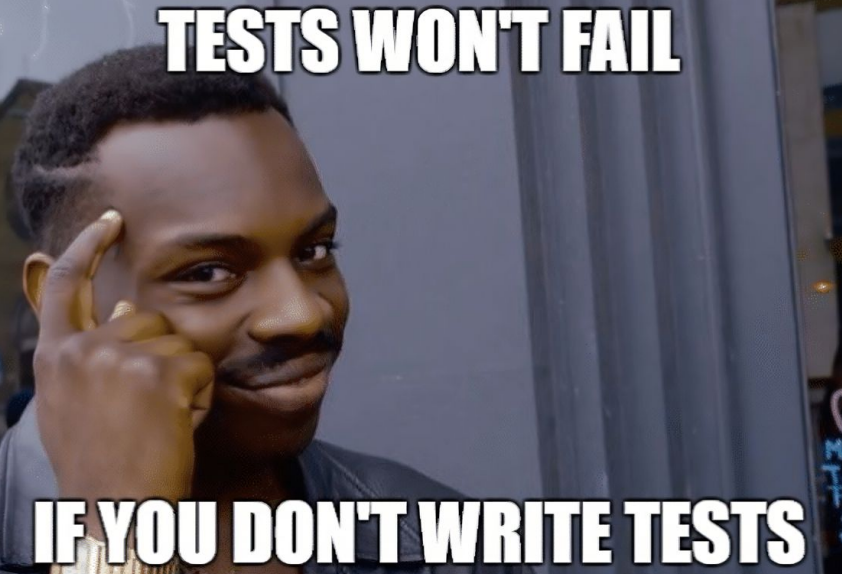
</p>
 
I know... Many developers don't like testing. Testing, in Software Development, has 
traditionally been associated with the idea of finding errors or "bugs" as we know them. 
The first "bug" was found on 1947, and was a real bug, a moth, that was trapped in a 
computer inside Harvard University:

<p align="center">
  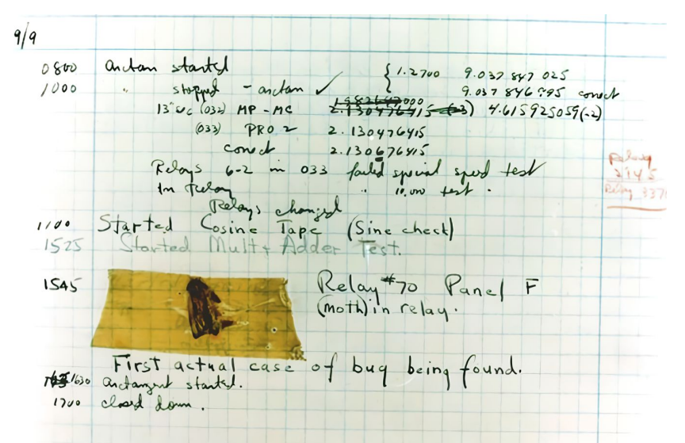
</p>

Of course, there is more value than just "finding bugs", more specifically two:

- **Verification**: Confirming that the software functions as the specifications say it 
should.
- **Validation**: Confirming that the software functions per the user requirements.

These goals have been historically reached via more or less manual testing, for which 
there are two main categories of tests:

- **Black-box Testing**: Examines the outside of the software, without knowledge of the 
internal workings.

<p align="center">
  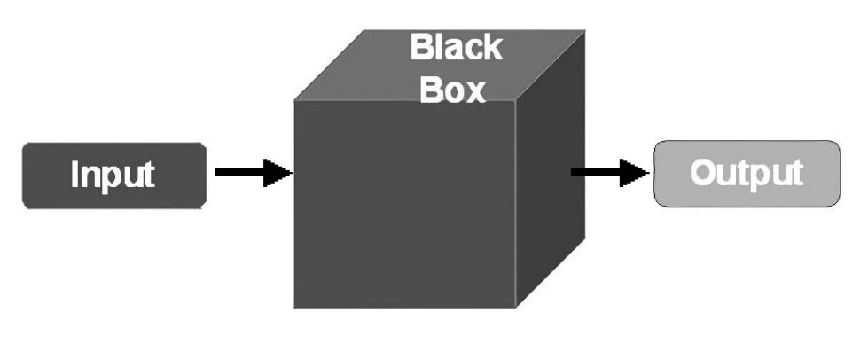
</p>

- **White-box Testing**: Examines the inside of the software, the inner workings.

<p align="center">
  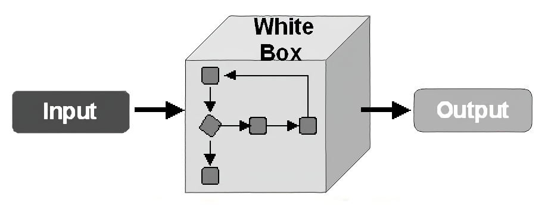
</p>

Throughout this article, we'll focus on the **white-box testing**.

Great, we know *what* to test, but what about the *when* ? For this purpose there are 
many testing strategies, but we'll only mention two:

- **Incremental Testing**: Testing is performed incrementally, with each new feature or 
change being tested as it is added to the system. This allows for early detection of 
issues and reduces the risk of introducing new bugs.

<p align="center">
  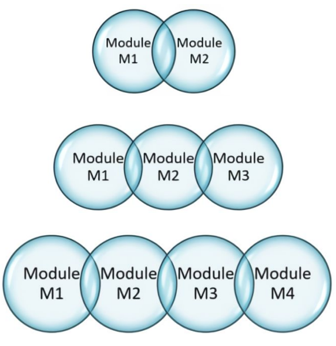
</p>

- **Regression Testing**: Testing is performed after each change to ensure that the 
changes have not introduced new bugs or broken existing functionality.

<p align="center">
  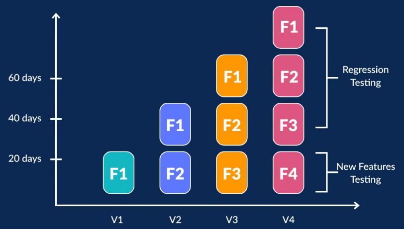
</p>

These and other testing strategies can now be easily automated and run, but in the early 
years of testing, this was not the case:

- Writing and running tests required a lot of codification since no frameworks existed
- A test suite run could take hours
- Outputs had to be humanly checked
- Results of the tests had to be manually recorded in text files or even paper

<p align="center">
  
</p>

Okay, we have the *what* and the *when*, but

## How should we test ?

<p align="center">
  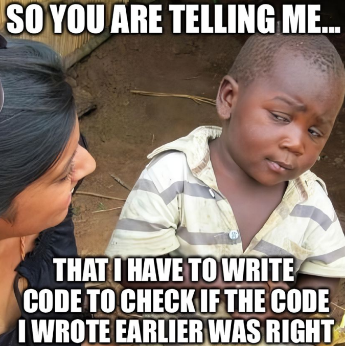
</p>

Let's go over some basics of white-box testing: first off, stages:

- **Unit Testing**: testing individual components, like a method, function, or class.
- **Module Testing**: testing a set of units that come together as a collection. This is 
usually developed together with unit-testing even though it may be considered the first 
form of integration testing.
- **Integration Testing**: sometimes called *sub-system testing*, it involves testing 
that the interfaces between sub-systems and components, often divided among different 
teams, work as expected.
- **System Testing**: also called *end-to-end testing* or *E2E*, this means testing the 
complete system prior to delivery.
- **Acceptance Testing**: also called *alpha testing* or *beta testing*, it involves 
making users test the software to ensure it meets their requirements.


The testing pyramid, introduced by Mike Cohn, suggests that most tests in a software 
application should be unit tests, as they are the quickest and easiest to run. The 
pyramid is structured as follows:

**Unit Tests** form the pyramid's base, as they are highly specific and fast.
**Integration Tests** sit in the middle, testing interactions between components.
**End-to-End Tests** are at the top, being often slower and more complex to maintain.

<p align="center">
  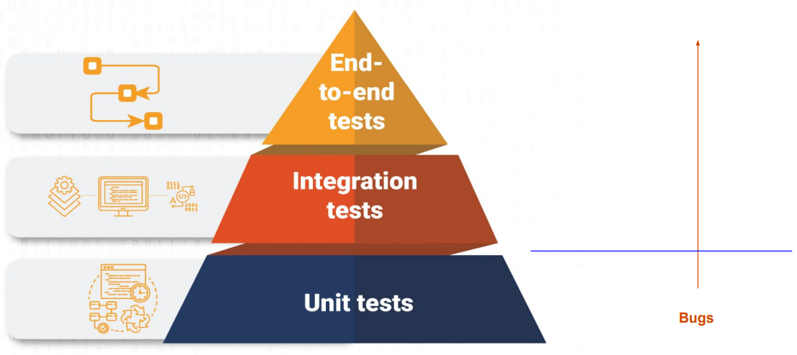
</p>

Unit and Module testing allow developers to confirm that each part works correctly on 
its own, independent of external dependencies. These tests are critical because they 
offer instant feedback on whether small parts of your codebase work as expected, helping 
to identify issues early in the development process. This saves time and resources by 
catching bugs before they move up to integration and E2E testing, where they are often 
more costly to fix.

## Effective Testing Practices

<p align="center">
  
</p>

Poorly designed tests can quickly become a burden, that's why unit tests should:

- Be simple, concise, focused and light-weight. They must run fast and help us localize 
problems.
- Be organized in a predictable way, either close to the code or in a similar structure.
- Have descriptive names easily understandable.
- Have only one responsibility per test case. One test result should be irrelevant to 
others.
- Consider most scenarios, typical cases, edge cases and error conditions.
- Be easily found, by being organized in a predictable way.
- Be independent of other model or test code, to avoid false positives and negatives.
- Mock only external dependencies, like database connections or non-deterministic 
responses.
- Avoid over-mocking, which can lead to brittle tests.
- Be flexible enough to survive refactoring while still validating functionality. Tests 
shouldn't be too dependent on the current implementation.

Developing effective unit tests requires a solid approach to test structure and purpose, 
for which we can use Bill Wake's triple A pattern:

**Arrange**: Setup what's needed (objects, dependencies, or states). This initial state 
is usually accomplished by a *test fixture*.
**Act**: Execute the operation or function under test.
**Assert**: Check the results, verifying that the outcome matches expectations.

<p align="center">
  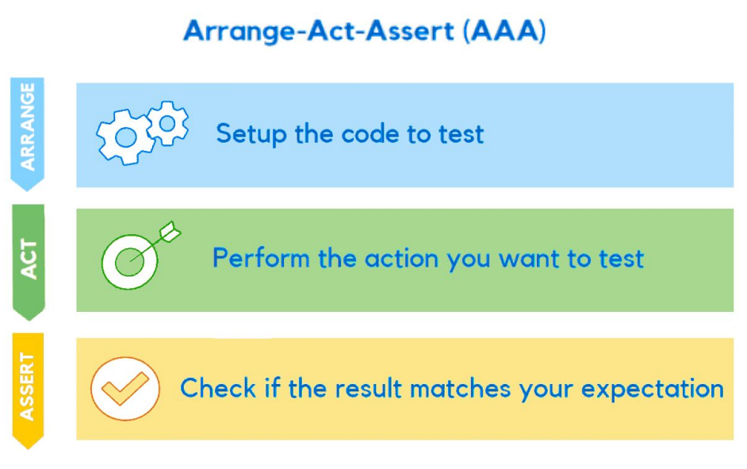
</p>

Though following this pattern you must be careful to create as fewer possible objects 
and re-use them as much as possible.

As a side note, while code coverage (percentage of code covered by tests) is often 
tracked as a quality metric, high coverage alone does not guarantee quality, and may in 
fact lead to low-value tests. The goal should be meaningful coverage, focusing on tests 
that add value by validating critical paths and common edge cases. Meaningful tests 
often reveal insights about the design and lead to more adaptable, decoupled systems.

## Understanding TDD Origins and Concept

<p align="center">
  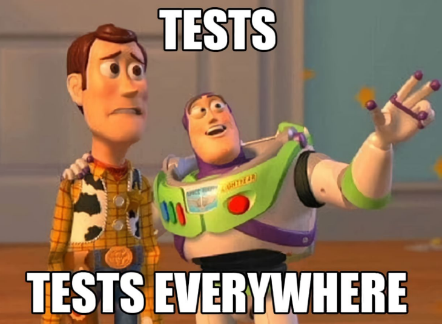
</p>

Kent Beck, born 1961, is the person behind the "rediscovery" of TDD. Kent is a software 
engineer from Oregon with a Master in Computer Science, creator of the Extreme 
Programming (XP) methodology, of the SUnit and JUnit testing framework, one of the 17 
original singatories of the Agile Manifesto, and the pioneer of Test-Driven Development 
(*what a legend !*).

<p align="center">
  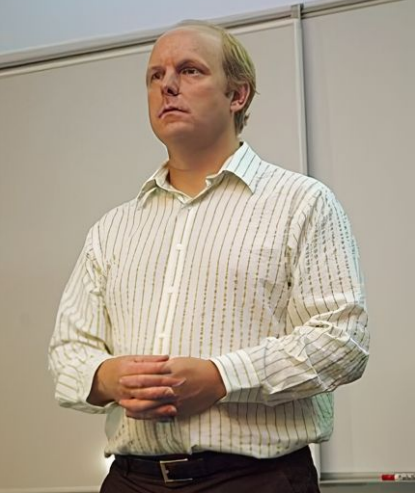
</p>

He says it's a "rediscovery" because TDD seems to have been a common pattern of 
development back in the punched tape era; you grab the input tape, write an expected 
output tape, and then make a program that generates the same output.

<p align="center">
  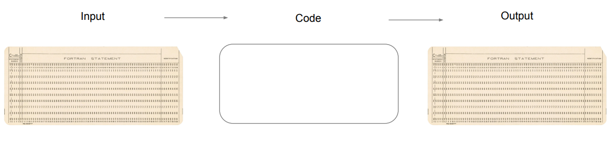
</p>

As its earlier form, TDD is a software development methodology that consists of writing 
tests for code before actually implementing the code itself. This approach was 
popularized as a means to create robust, adaptable software with a focus on simplicity 
and continuous feedback. In his seminal book, "Test-Driven Development: By Example," 
Beck introduces TDD as a tool to improve software quality and developer productivity 
through an iterative cycle: Red-Green-Refactor.

<p align="center">
  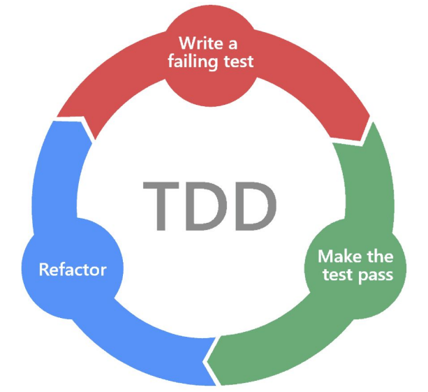
</p>

The TDD process works in a sequence:

- **Write a test**: Before writing any functional code, the developer writes a test that 
specifies what the code should accomplish. This test is expected to fail initially since 
there is no implementation yet. This is known as the "Red" state.
- **Write the minimum code**: Once the test is defined, the developer writes the 
smallest amount of code necessary to make the test pass. This is the "Green" phase, 
where functionality is minimally implemented to satisfy the specific test requirements.
- **Refactor**: With the test passing, the developer cleans up the code, making it more 
efficient or readable without changing its behavior. This refactoring can be considered 
a design activity.

## Think-Design-Develop ?

<p align="center">
  
</p>

TDD could very well mean that, as opposed to simply start developing with whatever you 
come up first to try to solve the problem at hand. Writing tests first makes you 
inevitable have to make yourself some questions:

- Where does the functionality belong ? *Is it a modification of an existing method, a* 
*new method on an existing class, an existing method name implemented in a new place,* 
*or a new class ?*
- What should the names be called ?
- How are you going to check for the right answer ?
- What other tests does this test suggest ? *Kent encourages having a list of future* 
*tests to be written once the current test is passing*

This process is done iteratively with very short changes, though Kent Beck says it can 
be done bigger and faster too, just that being able to take bigger or smaller steps is a 
skill that everyone should have.

In short, TDD is:

```
while not satisfied:
    write_or_refactor_tests()
    while not tests_pass:
        write_or_refactor_code()
```

This is what Kent calls *a positive feedback loop* because of the reassurring of tests 
passing each iteration, whereas coding without tests passing makes you feel more stress, 
with more stress you test less, make more errors, then feel even more stressed and so on.

## Why do we need TDD ?

<p align="center">
  
</p>

Michael Feathers in his book "Working Effectively with Legacy Code" considers *legacy*
*code* simply "code without tests", and says that **code without tests is bad code**. No 
matter how pretty or object-oriented or well-encapsulated it is.

He says *"Without tests, we really don't know if our code is getting better or worse"*.

There are four reasons to change software: adding a feature, fixing a bug, improving the 
design, or optimizing resource usage. Having tests help achieving all four of these 
while making sure existing functionality remains intact, as well as guiding the new code 
being introduced.

It enhances software quality by shifting the focus from implementation to design. Tests 
act as a specification, guiding the structure and behavior of the codebase while 
maintaining a safety net against regressions. The process helps reduce bugs, support 
sustainable pace in development, and encourages better design by highlighting how 
different components interact and evolve, producing loosely coupled and highly cohesive 
units.

Martin Fowler notes on his blog that TDD isn’t just a way of writing tests first; it 
fundamentally changes how developers think about building software. By writing tests 
that define the desired behavior upfront, TDD encourages incremental development, small, 
focused code changes, and early identification of potential design issues.

## Chicago vs. London Schools of TDD

<p align="center">
  
</p>

The TDD practice has evolved significantly since its inception, giving rise to two 
well-known approaches often referred to as the *Chicago School* and the *London School*. 
While they share a common foundation (testing before writing production code and 
following the red-green-refactor cycle), their philosophies and methods differ due to 
distinct views on software design and testing focus.

### Chicago School (Classic TDD)

The Chicago School of TDD traces its lineage to the Chrysler Comprehensive Compensation 
project in Detroit and the early practices of Extreme Programming (XP) developed by Kent 
Beck, Ron Jeffries, and others.

This school emphasizes *state-based testing*, where tests focus on validating the final 
state of an object after operations have been performed. It is outcome-driven, with 
minimal mocking and aligned with user expectations by mirroring real-world scenarios as 
much as possible. This results in simpler and less brittle tests, though they may be 
too coupled to implementation or have limited design feedback because of not checking 
how objects interact.

Chicago tests are not different than those we defined in earlier sections. This school 
is usually associated to "not mocking" but that's not true; even Kent Beck and 
Michael Feathers encourage mocking when it makes sense.

A typical test in this school also follows the AAA pattern described earlier, and this 
limited mocking style results in a much better technique for systems that are not 
designed in pure object-oriented paradigm.

A Chciago School test looks pretty much like the 3A pattern:

- Initialize the needed state and objects.
- Execute the actions that are unde test.
- Check that the results match the expectated ones.

### London School (Mockist TDD)

The London School emerged from the innovations of the London Extreme Tuesday Club and 
was championed by Steve Freeman and Nat Pryce, authors of *Growing Object-Oriented 
Software, Guided by Tests*. The term "London School" was introduced by Michael Feathers 
in 2009 as a counterpart to the Detroit/Chicago School.

This school takes an *interaction-based testing* approach, focusing on how objects 
collaborate and communicate during execution. It is behavior-driven, with a strong use 
of mocks and stubs to isolate units for testing, and promotes decoupled and modular 
design. This is useful for complex object-oriented systems and helps with early design 
insights, however, it can be more complex to set up and maintain, and tests may be 
fragile as well as too abstracted from the system's outcome.

Adhering to London School means you'll find yourself using some of these:

- **Fake**: It's a fake and simplified object that mimics the expected behavior of a 
real one for testing purposes.
- **Mock**: It's a fake object that allows for special assertions on its interactions.
- **Stub**: It's a fake object that returns predefined responses to method calls.
- **Seam**: It's a place where you can change behavior for testing purposes without 
affecting the code under test, like patching certain code.

London School is associated to a "mocking only" style of TDD, but that's not true 
either; the pioneers of this school were more focused on pure OO design and thus focused 
more on the collaboration and communication between objects.

A London School test could look like this:

- Create any required mock objects.
- Create any real objects, including the target object.
- Specify how you *expect* the mock objects to be called by the target object.
- Call the triggering method/s on the target object.
- Assert that any resulting values are valid and that all the expected calls have been 
made.

## Concusions

<p align="center">
  
</p>

The most important thing in TDD is not its methodology, the code coverage nor the code 
correctness (absence of bugs), but the  emphasis on testing and refactoring.

**"If you look closely into the tests, the tests will look back at you"**

Unit-tests are not only for finding bugs or validating specifications; they give us 
insights about the design of the system, its elements, and how they interact with each 
other. They are also another way of documentation, through which we can learn how the 
system works, what is expected of its behaviour.

In a pure-style of TDD you'd have to write twice the lines of code in the day, since 
you'll do as many lines of test code as model code, but you would be able to make daily 
changes confidently, thanks to the ability to rapidly make regression testings (we could 
call these *confidence-giving tests*).

Over which school is better, I think it's a matter of system design so for example, 
Chicago TDD makes more sense in a mixed or functional paradigm system, and London or 
Mockist TDD is ideal in a pure and perfectly designed system with OOP.

Both schools, though, share the same foundational goal of TDD: think about the design of 
the code you are about to write by creating first the tests, and then running them every 
short change to shorten the feedback loop and improve code quality and design.

If you want to go carefully with your development and improve your code quality output, 
you should definitely try TDD as presented by Kent Beck.

If you think you can move faster, you can have a more free style but still give 
importance to unit-testing, and the priceless feedback it gives you.

## References

- *University of Minnesota. (n.d.). Software Development Processes and Methodologies.*
- *Beck, K. (2002). Test-Driven Development: By Example. Addison-Wesley.*
- *Feathers, M. (2004). Working Effectively with Legacy Code. Prentice Hall.*
- *Meyer, B. (1997). Object-Oriented Software Construction. Prentice Hall.*
- *Codemanship. (n.d.). London School vs. Classic TDD? Nope. It’s London School AND Classic TDD [Video]. YouTube. https://www.youtube.com/watch?v=uVHGt2qbjXI*
- *Cascade Failure. (2023). Schools of Test-Driven Development. https://cascadefaliure.vocumsineratio.com/2023/01/schools-of-test-driven-development.html*
- *Freeman, S., & Pryce, N. (2004). Growing Object-Oriented Software, Guided by Tests. Addison-Wesley.*
- *Khorikov, V. (2018). Unit Testing Principles, Practices, and Patterns. Manning Publications.*
- *Fowler, M. (n.d.). Martin Fowler’s Blog. https://martinfowler.com*
- *Jeffries, R. (n.d.). Ron Jeffries’ Blog. https://ronjeffries.com*
- *Osherove, R. (n.d.). The Art of Unit Testing. Manning Publications.*
- *Cooper, I. (n.d.). TDD: Where Did It All Go Wrong? [Talk].*
