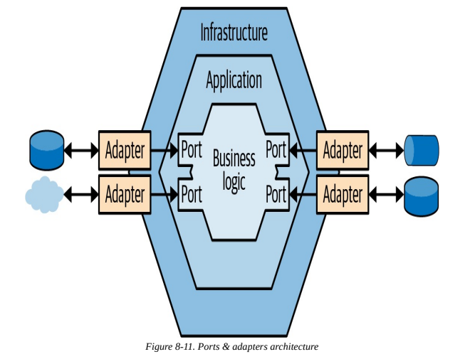

Title: Architecture 101
Date: 2025-08-09
Modified: 2025-08-09
Category: Articles
Tags: software development, software engineering, software architecture, design patterns
Slug: architecture-101
Authors: Juan José Farina
Summary: Software architecture scares you ? Come here, you'll find all the basics and not-so-basics about designing architectures !
Keywords: software, development, engineering, architecture, design, patterns

---

### Do you know what is this ?

  

### Don't worry, you'll understand

Feeling overwhelmed when trying to learn about software architecture ?

You're not alone. In the last couple of decades, different authors have used
different terminologies and have come at different conclusions and variants of
architectures.

Learning about architecture today is probably more challenging than it was 15
years ago because there are many more possibilities and much more information,
but not a clear and concise guide (at least, that I know of).

Today I'll be sharing what I've learnt so far from my professional experience,
from my professional education, and my personal research and practice. A few
books have greatly aided me on this, as well as countless videos, and I'll be
listing them at the end of the article.

Without any further ado, let's talk about **architecture**

## What does all of this mean ??

Architecture design has plenty of terms that are ambiguous, similar, and
sometimes vaguely described.

Starting by the concept of **software architecture** itself: the _architecture_
is the _high-level blueprint of the system_; it comprises the subsystems or
components that interact with each other in order to solve a problem. It is
analogous to the more common use of architecture, if you build a residential
building, you would design a blueprint that comprises the whole building with
each of the apartments, but you won't design each apartment. That's a different
task.

Well, the same happens in software engineering. Architecting an application
means thinking the inputs of the system, the components and subsystems, how
they communicate with each other, and what is the final artifact. Software
architecture is essentially about boundaries, communication, and their
relationship to the software's evolution.

Let's put an example: if you need to design an e-commerce application, you may
think of the following components: authenticator, checkout, payment, catalog,
etc.

Designing how those components (the apartments of the building) work (are
designed) is what is called **software design**: this is one level directly
below the _architecture_, it deals with how modules and objects will be
implemented and which design patterns to use. Basically, a high-level design of
the code implementation. Using the previously mentioned _checkout_ as example,
one could come up with a TaxCalculator object, a Cart object, maybe use a
Strategy pattern for the shipping, etc.

  

_Design patterns_ are specific and in general well-documented and known, you
can refer to Google, Youtube or almost anywhere on internet about them.

_Architecture patterns_ on the contrary tend to be confusing and vague;
sometimes the same pattern is described in different ways and different
patterns from different authors may have differing terminology for things that
are essentially very similar.

Let's address some terms upfront; don't worry if you haven't yet heard about
any of these:

- **Layers**: you'll get to hear **A LOT** about these, but I feel no one
  really explains what _these are_. Well, we could say they "aren't", because
  layers are abstract concepts, they are _logical boundaries_, they "don't
  exist". When someone says "layer" they basically mean a cohesive group of
  modules/code that serve some unified purpose. You can think of it as
  basically a "directory" if it helps you. But the main purpose of talking
  about layers is when you understand more about dependency, coupling, and
  stability. Layer is the fuzzy word we use when we want to say something like
  "a group of code should only do _X_ and should only depend on _Y_ layer".

- **Tiers**: this is much easier; tiers are _pysical boundaries_. Contrary to
  layers, tiers are entirely different resources, like separate web
  applications, databases, etc. For some reason, people sometimes confuse
  layers with tiers, but hopefully you've now easily understood the difference.

- **Services (layer)**: this is another ambiguous concept; some people treat
  services as mere facades of the business logic, having the responsibility of
  orchestrating the logic and providing a public API. Other people treat
  services as the business logic itself, essentially merging two layers into
  one.

- **Controllers**: same as the orchestrator meaning of _services_. The _MVC
  Architecture_ will call them controllers, while the _Layered Architecture_
  will call them services.

- **Entities**: while this may mean different things for different authors,
  entities should mean the modeled data structures that your system
  persist/store, as in _Entity-Relationship Diagrams_ for databases.

- **Models**: One of the most ambiguous terms. Models may refer to **many**
  things, like entities, data structures, objects, or even machine learning
  models if you work in that field. I would encourage people to only call
  "models" to data structures and/or objects that belong to the domain layer.

\*_By the way, data structures should have no behaviour, and objects should_ 
_have limited or no state (and encapsulated), you can learn more about this_ 
_from Uncle Bob (https://blog.cleancoder.com/uncle-bob/2019/06/16/ObjectsAndDataStructures.html)._

- **Schemas**: these are specifications for validating data; similar to models
  and entities, but these should only serve the purpose of defining a specific
  "filtering structure" for-so-say, not to have real value on itself.

This should be a good basis for your understanding of software architecture
terminology. We haven't covered specific terms of the Domain-Driven Design
style, which we'll touch upon near the end of the article.

## Architecture Models & Practices

There are multiple levels at which to look at the architecture of a system. Ian
Sommerville likes to say there are two main ones:

1. **Architecture in the small**: concerned with the architecture of individual
   programs. At this level, we are concerned with the way that an individual
   program is decomposed into components.

  

2. **Architecture in the large**: concerned with the architecture of complex
   enterprise systems that include other systems, programs, and program
   components. These enterprise systems may be distributed over different
   computers, which may be owned and managed by different companies.

  

Another way to understand it is by saying that a "small architecture" is a 
grouping of layers that make up a single output (albeit through an API, a UI, 
etc.), while a "big architecture" is a grouping of tiers, composed of many 
groups of layers with their distinct outputs.

When taking design decisions about a "small architecture", you must take into
account the _functional, behavioral, and social requirements_ of the system.
Quoting the architect Louis Sullivan: _"Form follows function"_; this
architecture principle states that the form (architecture) should relate to the
intended function. We'll learn different architecture patterns later that will
help better understand which "forms" follow which "functions".

Now, as Bosch explains, individual components implement the functional system
requirements, but the dominant influence on the non-functional system
characteristics is the system’s architecture, the "architecture in the large".

Some examples of **non-functional requirements**.

- _Performance_: if this is a priority, perhaps you will want a smaller
  architecture and/or smaller components.
- _Security_: add layers and validations before reaching critical components or
  data.
- _Safety_: reduce the number of components where safety-related operations are
  required, so they are co-located in a single place or few number of places.
- _Availability_: for availability you may want to go with components that can
  be replaced fast in case of failure, or other fault-tolerant mechanisms.
- _Maintainability_: for high maintainability, you'll want to avoid as much as
  possible the coupling between components.

As you can see, it's not possible to optimize all five non-functional
requirements; they all come with trade-offs. When designing an architecture
it's important to understand the compromises that will be done.

Architectures may consist of:

- _Components_: an abstract unit of software.
- _Connectors_: an abstract mechanism that mediates communication.
- _Data_: an element of information.
- _Properties_: functional and non-functional properties that derive from the
  architecture.

Roy Fielding has an amazing definition about the elements of an architecture:

  

We'll take a deeper look at these elements in the following sections.

## Architecture In The Small Patterns

These architectures could all be considered _monolithic_, since we are talking
about only one deployed application in all cases. This does not mean you can't
or won't use these in, for example, a _Microservices Architecture_; that and
other large architectures have multiple "monolithic" applications.

If it's still confusing, it'll hopefully become clearer when we'll touch upon
architecture in the large.

### MVC Architecture

This is one of the most known and basic architectures, it separates the
codebase into Model, View, and Controller layers.

- **Model**: code that manages data storage and operations, along with the
  business rules for how to manipulate the data.
- **View**: code that handles how the data is presented to the user.
- **Controller**: code that controls user interactions and orchestrates the
  view and model layers.

In this pattern, the controllers are orchestrators of the system; they receive
each user interaction and decides what to do: either call the model layer for
retrieving, storing or transforming data, and/or call the view layer to change
what's presented to the user.

The biggest point on this architecture is that View and Model layers are
completely separated and decoupled; they can change and evolve without
interfering with each other. But Controller needs to be aware of both layers.

After the birth of internet, this became one of the most common web application
architectures, in a time when all of this was handled in a
_Server-Side-Rendering_ way.

The user would use web browsers to request the server either for HTML files or
for processing data (Controller), the server could potentially interact with a
database and/or transform data in some way (Model), and finally return an HTML
web page (View).

  

The flow of this pattern is:

- _User_ interacts with the **View**
- A **Controller** handles the interaction
- If applicable, the **Model** handles data operations
- The **Controller** sends an updated **View** back to the _User_

This is suitable for small applications that handle mostly CRUD operations.

### Layered Architecture

Also known as _N-Layer Architecture_, in this pattern each layer should only
know the one immediately below itself, which improves decoupling from MVC, and
thus is suitable for mid-size applications.

One key aspect of this architecture is that layers communication should be
based on interfaces, allowing for layer independence and replaceability by
simply adhering to the agreed interface/contract. This also means that if one
layer needs to change an interface, there is only one adjacent layer that
should be affected.

While this pattern doesn't necesarily mean a certain number of layers, it is
usually agreed that the pattern uses at least four layers, with varying names:

- _Presentation_ **|** _User Interface_ **|** _View_
- _Service_ **|** _Application_ **|** _Use Case_ **|** _Controller_
- _Business Logic_ **|** _Domain_ **|** _Core_ **|** _Model_
- _Data_ **|** _Infrastructure_ **|** _Persistence_

Don't mind the different names for each layer, they all mean basically the
same. The four layers are responsible for:

- **Presentation**: this is your gateway to the external world; users and/or
  integrated systems will communicate with you through this layer, and you will
  repond back with it too. This can take the form of a UI, a CLI, an HTTP API,
  events, message topics, etc.
- **Service**: here lives the code that will handle the interactions, that will
  orchestrate the operations required for specific use cases. It's like the
  glue code to stick together all the core functionalities under a specific
  label.
- **Business Logic**: this will be your core logic, where you solve a specific
  business problem. Typically for solving this, you will need some data.
- **Data**: your data toolkit with which to gather what you need and apply any
  operation like retrieving, updating, creating, deleting, etc.

  

A classical problem associated with this pattern is that as your application
grows and becomes more complex, the coupling between your domain and your
infrastructure layers slows you down and introduces bugs and development
dificulties.

### Hexagonal Architecture

Also called _Clean Architecture_, _Onion Architecture_ or _Ports and Adapter_
_Architecture_; using different terminology in most cases too, but the core
idea is the same in all those architectures.

This architecture is based on the _Dependency Inversion Principle_, which 
states that high-level modules should not depend on low-level modules. This 
means that our domain or business logic layer should not need to call (depend) 
on the infrastructure layer (which is something that happens in the Layered 
Architecture).

Instead, the domain layer will use abstractions or _ports_, which may be filled 
with different implementations or _adapters_ for communicating to external 
systems. This way, we end up with a 3-layers architecture as follows:

  

This is a commonly recommended architecture for complex applications, though 
due to its complex pattern it may not be the best option for small to medium 
sized apps. This requires good skills in software design, DIP and dependency 
injection.

### Others

There are numerous other possibilities, and infinite possibilities for
variation.

## Architecture In The Large Patterns

As we have already stated, all architectures previously mentioned ("small"),
could be considered isolated monoliths.

### Client-Server Architecture

This is the most basic _network-based architecture_. It consists of:

- **Server**: that offers a set of services by listening to requests.
- **Client**: that sends requests to the server.

  

In other words, a client makes requests that trigger reactions from servers. 
Those reactions may be very different processes, and the returning data (if 
any) may be of very different natures.

### N-Tier Architecture (also called Multi-tier)

This is the tier-version of the Layered Architecture. The idea is the same: 
having multiple tiers (physical resources) being deployed and maintained 
separately, each tier only communicating with the inmediate tiers.

There is also a variant where a tier may call any of the downstream tiers.

A typical 3-tier application may consist of a frontend (client app), a backend 
(server), and a database. Of course, this architecture may have many more 
tiers, for instance having multiple databases, or other kind of components.

### Pipe and Filter Architecture

There are two versions of this pattern: one where each filter must be
completely independent of other filters, they must not share state or
interfaces; and another (usually called "Uniform Pipe and Filter") where the
filters have normalized interfaces for communication.

We could say this is a "specific N-Tier Architecture", since this pattern 
consists of multiple components, but the core idea here is that there is a 
clear sequential process that is being executed.

### Repository Architecture

This is what could be called an _extension architecture_, because this pattern
can be added to other architectures. The repository pattern consists of a
single shared repository to access all data among different components/services.

This is good for managing data in a centralized and consistent manner. Other
components don't need to pass data among themselves, which decouples their
communication.

The repository will also need a means to notify components/services of data
changes, which may be done directly or through an _Orchestrator pattern_.

This pattern may be problematic when the database schemas change frequently or
you have big concurrent write operations which can cause collisions.

There is also a more modern variant version of this called **Blackboad**
**Architecture**, which can actually be a small architecture around the same
principle of a shared center of knowledge on which different expert modules
contribute to generating a response; this pattern is usually said to be of
greatly used in Data, ML and GenAI applications.

### Service Oriented Architecture

This is similar to the N-Tier Architecture, in the sense that we will be 
deploying numerous physical resources, but here we will be splitting the 
system's logic in multiple _services_, that is, smaller cohesive and 
independent applications that achieve small isolated goals.

This architecture improves maintainability and scalability, allowing different 
services to scale up on-demand, to be maintained by different teams, and also 
to implement more caching and fault-tolerance mechanisms.

A common pattern to use with SOA is the use of an _Enterprise Service Bus_, 
which is a component that allows the publishing of messages (usually to a 
_topic_ or _queue_) that are sent to all the services that are subscribed.

### Microservices

This is one step further in the SOA direction; each service now must be 
completely isolated and independent, having separate deployments and even data 
storages (contrary to SOA which has shared databases). Each microservice must 
have only one very small task to accomplish and be proficient in.

### Event-Driven Architecture

In essence, this is any distributed architecture (like SOA or Microservices) 
that communicates through events. At first look, this looks very similar to 
ESB messages, but they are not the same: an event is a message, but a message 
is not necessarily an event. Messages may be:

- **Events**: describing a change that has already happened.
- **Command**: describing an operation that still has to be carried out.

Events are past actions, and thus must be written in past tense: 
DeliveryScheduled, OrderPlaced, etc.

This must not be confused with _Event-Sourcing_, which is the technique of 
storing all events as changes to _domain objects_, in order to be able to 
replicate any state of the system, not only the current.

################################################################################

A good rule of thumb for figuring out what goes in the domain model and what goes in
other parts of the system, is understanding how important the functionality is to the
solution, and how likely it is to be changing.

Subdomain components like persistence mechanisms tend to not change much, but business
logic (core domain) tends to change more frequently because of feature development,
refactor, bug fixes, etc.

A software architecture is an abstraction of the run-time elements of a
software system during some phase of its operation. A system may be composed of
many levels of abstraction and many phases of operation, each with its own
software architecture.

################################################################################

## References

- _Fielding, R. T. (2000). Architectural styles and the design of network-based software architectures [Doctoral dissertation, University of California, Irvine]._
- _Sommerville, I. (2016). Software engineering (10th ed.). Pearson._
- _Kleppmann, M. (2017). Designing data-intensive applications. O'Reilly Media, Inc._
- _Khononov, . (2021). Learning domain-driven design. O'Reilly Media, Inc._
- _Poltorak, D. (2025). Architectural metapatterns: The pattern language of software architecture (Version 1.0). GitHub. Retrieved from https://github.com/denyspoltorak/metapatterns/blob/main/ArchitecturalMetapatterns/Architectural%20Metapatterns.pdf._
- _Wilson, G. (2025). The architecture of open source applications. Website. Retrieved from https://aosabook.org/en_
- _Microsoft. (2025). Azure architecture. Microsoft Learn. https://learn.microsoft.com/en-us/azure/architecture_
