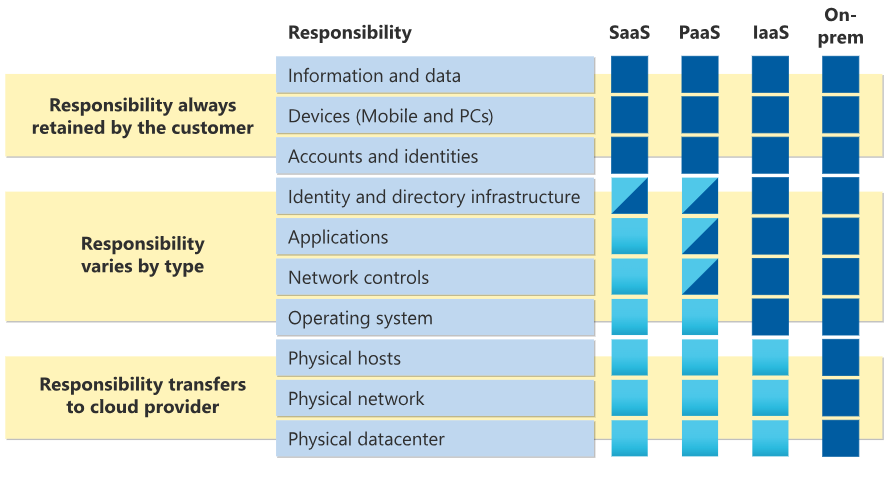

Title: Cloud Fundamentals
Date: 2024-07-31
Modified: 2024-07-31
Category: Articles
Tags: microsoft, azure, amazon, aws, cloud
Slug: cloud-fundamentals
Authors: Juan José Farina
Summary: All you need to know about cloud computing and two of the most popular cloud platforms, including their differences and the required knowledge to approve Azure Fundamentals and Cloud Practicioner.
Keywords: microsoft, azure, amazon, aws, cloud

---

## Before the Cloud

If you're new to IT and haven't hosted a webpage online, you may not know about the traditional hosting solutions that were used before cloud services starting to be available.

These involved, and still involve, paying either a shared or dedicated physical server stored in a data center, which you can access and configure via internet.

The main disadvantage of these solutions is due to their "physical" constraints, like having limited scalability, higher/regular maintenance, and danger of physical issues like hardware failure, natural disasters, or power outages.

If something happens to the data center, your server will be inevitably down.

## After the cloud

A cloud hosting solution consists of multiple servers and data centers interconnected. "Cloud" is `the delivery of computing services over the internet`. Some of these services could be:

- Virtual machines
- Storage
- Databases
- Networking
- Internet of Things (IoT)
- Machine Learning (ML)
- Artifficial Intelligence (AI)

Cloud platforms offer more reliability, scalability and flexibility than traditional hosting options.

## Basic cloud concepts

In traditional corporate data centers (`on-premises`), the company and IT departament are responsible for everything: maintaining all the infrastructure and software needed to keep the data center up and running. Clouds introduce the concept of `shared responsibility model`.

This means that the cloud provider is responsible for the physical data center, things like security, power, cooling, network connectivity, etc., while the consumer is responsible for the information, data, devices that are allowed to connect, and accounts and identities. And for operating systems, network controls, applications, identity and infrastructure, it depends on the `cloud service type` that you choose:

- **Infrastructure as a Service (IaaS)** - The cloud provides the basic infrastructure (physical security, power, connectivity, etc.) and the consumer is responsible for everything else.
- **Platform as a Service (PaaS)** - The cloud provides the infrastructure and the development environment, and the consumer is responsible for developing the software and managing the data.
- **Software as a Service (SaaS)** - The cloud provides everything from the infrastructure up to the software being consumed, and the consumer is only responsible for the data.

  

## Cloud service models

Cloud models define the deployment type of cloud resources. There are three main cloud service models:

- **Public Cloud** - it's built, controlled, and maintained by a third-party cloud provider, like Azure or AWS, and the organization access it through the internet.
  - No capital expenditures to scale up
  - Applications can be quickly provisioned and deprovisioned
  - Organizations pay only for what they use
  - Organizations don't have complete control over resources and security

- **Private Cloud** - it's a cloud that is used by a single organization. It can be hosted on-premises or in a dedicated offsite data center.
  - Organizations have complete control over resources and security
  - Data is not collocated with other organizations' data
  - Hardware must be purchased for startup and maintenance
  - Organizations are responsible for hardware maintenance and updates

- **Hybrid Cloud** - it's a combination of public and private clouds. It allows organizations to leverage the benefits of both models, like scalability, flexibility, and cost-effectiveness of public clouds, while maintaining control and security of private clouds.
  - Provides the most flexibility
  - Organizations determine where to run their applications
  - Organizations control security, compliance, or legal requirements

A fourth option is to use a `multi-cloud` approach, where you use multiple public cloud providers. This may be to use different features of each cloud provider, or maybe because you are migrating from one cloud to another, etc.

Two solutions related to using the cloud of Azure are:

- **Azure Arc**: allows you to manage your cloud environment, whether it's a public, private, hybrid, or even multi-cloud environment.

- **Azure VMWare Solution**: allows you to run VMware workloads on Azure.

## Consumption-based model

When comparing IT infrastructure models, there are two types of expenses to consider: `Capital Expenditures (CapEx)` and `Operational Expenditures (OpEx)`.

- **CapEx** - it's a one-time expense that is paid upfront, like buying a server or a computer.

- **OpEx** - it's a recurring expense that is paid over time, like paying for a service or a subscription.

Cloud computing falls under OpEx because it operates on a consumption-based model. You don't pay for the physical infrastructure, the electricity, the security, or anything else associated with maintaining a datacenter. Instead, you pay for the IT resources you use.

**Consumption-based models benefits include**:

- No upfront costs.
- No need to purchase and manage costly infrastructure that users might not use to its fullest potential.
- The ability to pay for more resources when they're needed.
- The ability to stop paying for resources that are no longer needed.

While in traditional datacenters you may overestimate or underestimate the amount of computation you need, in a cloud-based model, you don't have to worry about getting the resources needs just right. If you find that you need more virtual machines, you add more. If the demand drops and you don't need as many virtual machines, you remove machines as needed. Either way, you're only paying for the ones that you use, not the "extra capacity" that the cloud provider has on hand.

This helps you plan and manage your operating costs, run your infrastructure more efficiently, and scale as your business needs change.

## References

CONTINUE FROM HERE: https://learn.microsoft.com/en-us/training/modules/describe-benefits-use-cloud-services/2-high-availability-scalability-cloud

- *Microsoft Azure Fundamentals Official Training Course* - [https://learn.microsoft.com/es-es/training/courses/az-900t00](https://learn.microsoft.com/es-es/training/courses/az-900t00)
- *Supersonic Playground* - [https://www.supersonicplayground.com/resources/blogs/cloud-hosting-vs-traditional-hosting/](https://www.supersonicplayground.com/resources/blogs/cloud-hosting-vs-traditional-hosting/)
- *Cloud Panel* - [https://www.cloudpanel.io/blog/cloud-hosting-vs-traditional-hosting/#what-is-traditional-hosting](https://www.cloudpanel.io/blog/cloud-hosting-vs-traditional-hosting/#what-is-traditional-hosting)
