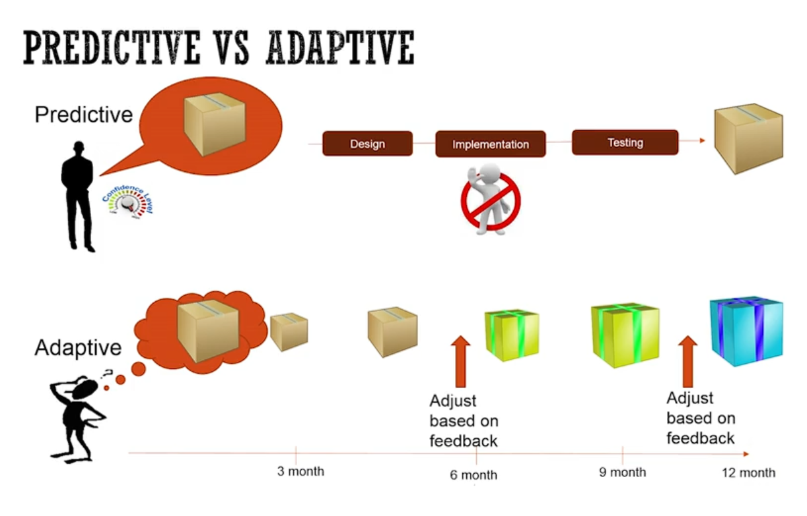
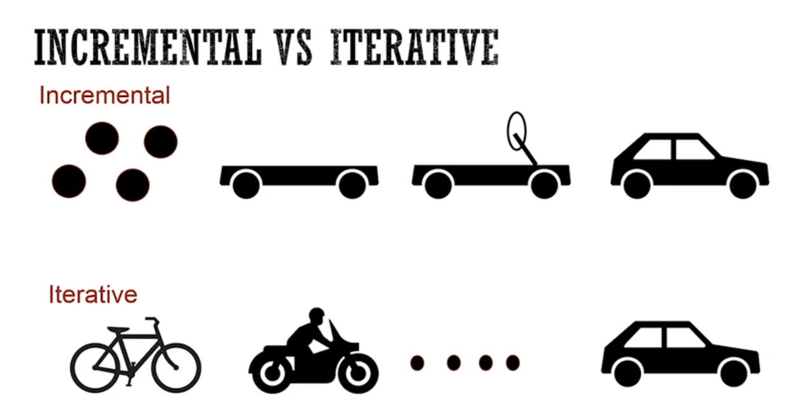
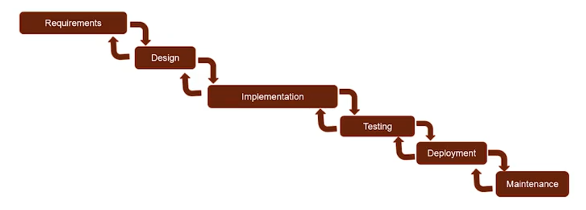
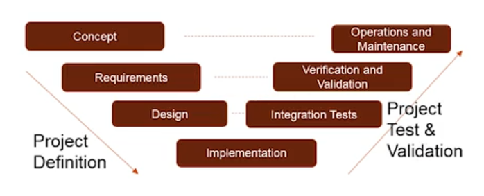
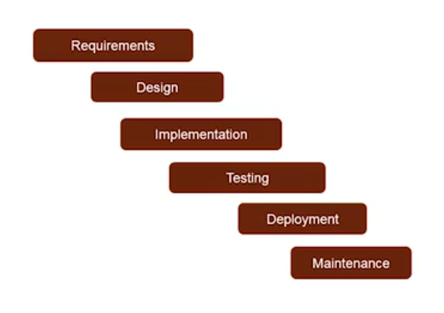
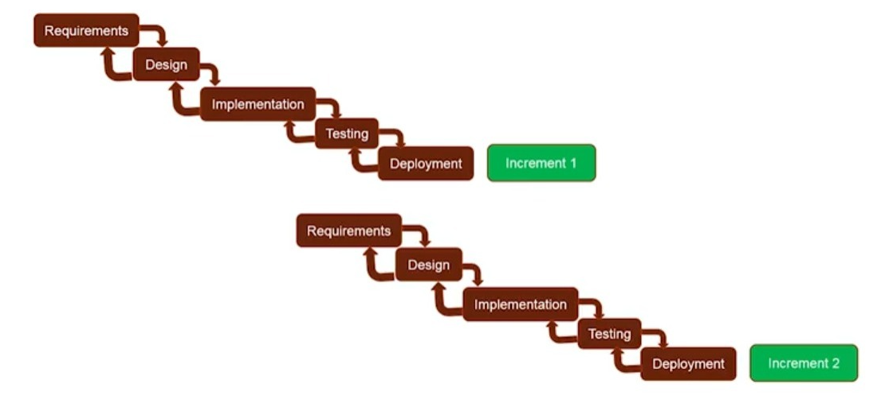
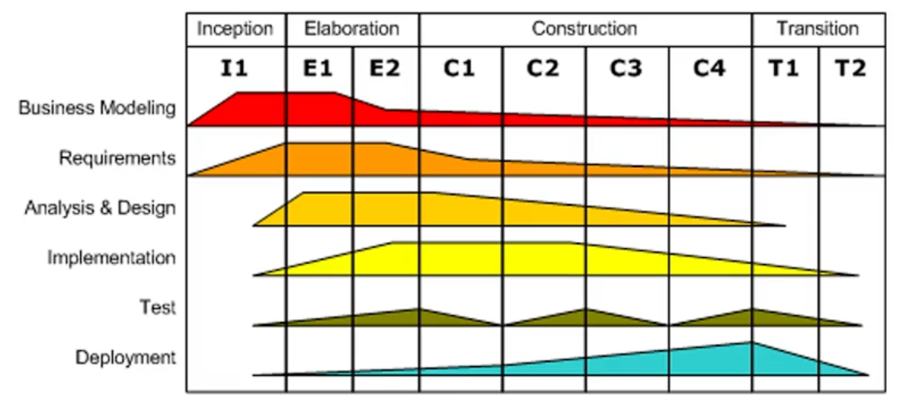
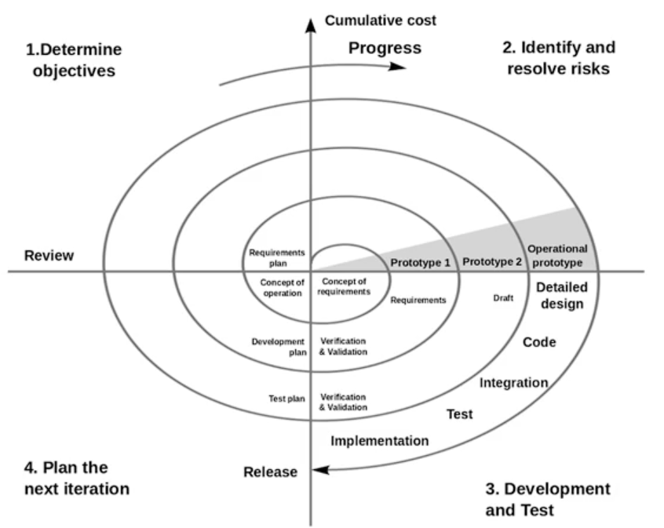
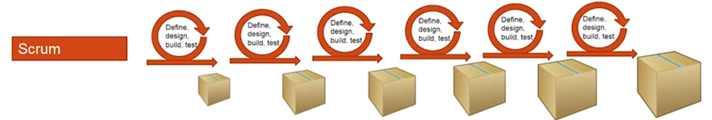
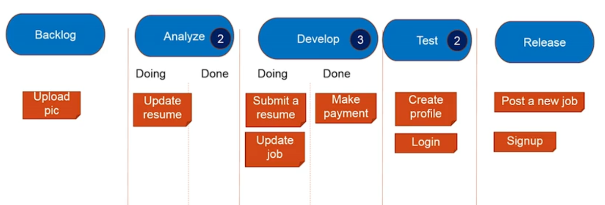

Title: Software Development Life Cycle, but with real knowledge
Date: 2025-08-09
Modified: 2025-08-09
Category: Articles
Tags: software development, software engineering
Slug: software-development-life-cycle
Authors: Juan José Farina
Summary: This is not "yet another Scrum guide", come and learn about all the different development models that exist.
Keywords: software, development, engineering, life-cycle, models, scrum, agile, waterfall

---

## Models Classification

Several different frameworks or models for developing software have been 
created during the decades. These models can be classified into two set of 
categories, being the first one about _requirements_:

- **Predictive**: you have a very good understanding of the requirements.

- **Adaptive**: you have an idea of what to build, but not exactly what and how.

  

Predictive models are about certainty and efficiency (there is no feedback 
needed), while adaptive models are about uncertainty and efficacy (feedback is 
vital). The other classification is about the _process_:

- **Incremental**: each increment develops a new part of the product

- **Iterative**: each iteration builds a slightly bigger but different product

  

Incremental models, while predictive, still benefit from some feedback along 
the process. Iterative models, on the other hand, allow for much more frequent 
feedback, allowing for more changes along the way.

Some models can also be incremental and iterative, as well as none of both, 
meaning the development goes from 0% to 100% in one go.

## Models

### Waterfall

It's a direct sequence of phases where a previous phase must be finished before 
it can go into the next. It's comprised of:

- **Requirements**
- **Design**
- **Implementation**
- **Testing**
- **Deployment**
- **Maintenance**

A variation that can be made is that at the end of each phase, you can have a 
feedback loop (called stage gates, or phase gates) and if the deliverable of 
the finished phase is not good enough, you can go back to improve it. The later 
in this model that you find an issue, the more costly it is.

This is a highly _predictive_ model that builds the software in one go, which 
makes it very simple, predictable, and efficient. But you should only use this 
model if:

- You know the requirements very well
- You know the requirements won't change
- Your team has experience building similar software
- Your translation from requirement to product is going to be perfect

On the bad side, this model isn't flexible to change, and you only get a 
release at the end of the development process.

  

### V-Model

Similar to the Waterfall Model, but this model places more emphasis on testing 
and validation since the earlier phases of development. Its phases are:

- **Concept**
- **Requirements**
- **Design**
- **Implementation**
- **Integration Tests**
- **Verification and Validation**
- **Operations and Maintenance**

This is still a highly _predictive_ one-shot model, but it encourages some 
validation early on, which adds more upfront work in favour of earlier 
detection of potential issues.

  

### Sashimi

This model allows for overlapping of its phases which optimises times. You can 
plan how much overlapping you want, either 2, 3 or more phases being able to 
overlap at the same time.

- **Requirements**
- **Design**
- **Implementation**
- **Testing**
- **Deployment**
- **Maintenance**

This model is slightly less _predictive_ than the previous ones, because once 
phases start to overlap, they are able to better and earlier identify issues, 
which the corresponding (earlier) phase can still adapt to, since it hasn't 
finished yet.

This model shortens the development time as well (coming from previous 
development models, which may take one or more years).

  

### Incremental Variants

All previous models can be adapted to work as _Incremental models_, meaning 
each process will finish with a piece of the finished work, like in _Program_ 
_Increment_ (PI, from _SAFe_).

These increments may start once the previous one finishes, overlap, or even use 
completely different models.

In all of these cases, this incremental approach is much more _adaptive_ than a 
one-shot model, allowing for each increment to gather new insights and change.

  

Another variation that exists of these incremental variations, is where you 
first gather all the _requirements_ upfront, then start the different increments 
without going back to requirements gathering.

The same can be done adding also _design_. In both cases, the model becomes 
less adaptive, but more straightforward.

### Unified Process and its Variants

In this model, the development life cycle is divided into multiple phases: 
Inception, Elaboration, Construction, and Transition. And each of these phases 
may have one or more iterations.

- **Inception**: this is usually a short phase where you establish the 
business case, the scope of the project, feasibility, and preliminary schedule 
and cost.
- **Elaboration**: this phase's goals are to capture requirements, address 
known risks, and validate the system architecture (MVP).
- **Construction**: the largest phase of a project, where the software is build 
throughout multiple iterations, in an incremental way.
- **Transition**: here is where the production deployment happens, where you 
get feedback, refine the system, etc.

A timeline is built around these divisions, planning the effort through 
different areas of development like: Business Modeling, Requirements, Analysis 
& Design, Test, Deployment.

  

Unified Process is more a _framework_ than a rigid model, and you can vary this 
and also use different models.

UP is more on the adaptive side of software development models. This is a good 
framework for middle to big projects with good amounts of uncertainty.

Some variants of this process include:

- Rational Unified Process
- Enterprise Unified Process
- Open UP
- Agile UP

### Spiral

This is a very iterative, adaptive, and risk-driven model, where you spiral 
through phases until you achieve your milestone. Each cycle may consist of:

1. **Determine objectives**
2. **Identify and resolve risks**
3. **Development and Test**
4. **Plan the next iteration**

There are three milestones to be defined on this model:

- **Life Cycle Objective**: you reached sufficient definition of a technical 
and management approach.
- **Life Cycle Architecture**: you reached a definition of the preferred design 
and architecture, and also eliminated or mitigated most risks.
- **Initial Operational Capability**: you reached a point of sufficient 
preparation of the software, site, users, operators, and maintainers, to launch 
the product.

  

As you can see, this process places risk addressing in a very central plane, 
which allows for increased chances of success, which makes this suitable for 
large and complex projects.

### Scrum

The core idea of Scrum is to _Plan, Build, Learn, and Repeat_. You iterate in 
an incremental manner, adapting to change after each Sprint.

  

In the Scrum framework, you have certain actors:

- **Product Owner**: talks with executives, stakeholders, customers, etc., and 
defines what needs to be done in what's called a _Product Backlog_.
- **Scrum Master**: makes sure the different Scrum ceremonies are made in a 
correct manner and time, and helps the team remain aligned and efficient.
- **Team**: during the _Sprint Planning_ they discuss the different _User_ 
_Stories_ in the backlog, and decide on which to commit for the upcoming 
sprint, effectively generating a _Sprint Backlog_.

A sprint may take anything from 1 to 4 weeks, and the team will work on the 
different tasks for the user stories. Every day the team will meet in what's 
called a _Daily Stand Up_ or sometimes called _Daily Scrum_, where each member 
says what they've been doing, what they'll do, and if they have any blockers.

At the end of the sprint, you should have two other meetings:

- _Sprint Review_: meet with the stakeholders/clients to demonstrate the work 
done, and get feedback.
- _Sprint Retrospective_: the team talks about the process, what went well, 
what didn't go well, and how to do better (action items)

A typical tool for understanding the team's direction is the _Burndown Chart_, 
which reviews how much of the work has been finished yet (usually based on 
estimated hours).

### Kanban

Kanban is more a philosophy of how to improve processess, rather than a defined 
process in itself. The central idea of Kanban is to consider the software 
development as a pipeline where we input tasks, and the pipeline outputs 
software.

  

It consists of four core properties:

1. **Visualize your workflow**: this is done by what's called a _Kanban Board_, 
which helps you visualize the flow of the work being done. The board has 
columns for each process a task undergoes.
2. **Limit Work-In-Progress**: in order to keep the flow going and avoid 
bottlenecks, Kanban sets limits to how many tasks may be being worked in a 
column; if the previous column finished the work, but the next is at its limit, 
then someone from the team may collaborate in finishing the next columns work. 
3. **Manage the flow**: if you find constants bottlenecks or issues throughout 
your flow, you may need to obtain more resources or address what is the root 
cause of the issues.
4. **Make Process Policies Explicit**: have clear definitions of when a process 
is done in each column and is ready to be moved to the next column.

And also three key principles:

- **Start with what you do know**
- **Agree to pursue incremental, evolutionary change**
- **Respect the current process, roles, responsibilities & titles**

## Project Life Cycle

Before choosing a development model, a project has other phases and concerns: 
you need to establish the contractual relationship, agree on deliverables, 
work to be done, costs, times, etc. Let's make a brief summary:

### Initiating

The first step is the _Proposal_: you start talking to your client, 
understanding their problem, what they would like to be done, you explain how 
you can solve it, etc. That becomes a draft document ("proposal") that is sent 
to the client (you may receive before hand an RFP, _Request For Proposal_, if 
the client reaches out to you first). Afterwards, these negotiations end 
becoming two major documents:

- **Master Services Agreement (MSA)** or **Framework Agreement**: this is a 
long scope relationship contract detailing the process of procuring software 
development services from you. It's more common in big companies and public 
organizations.
- **Statement Of Work (SOW)**: a more refined proposal that includes all the
details of the work to be done including scope, deliverables, schedule, 
pricing, etc. In smaller scopes, this may be your main and only document, 
including then details regarding the contractual relationship that would 
othewise go in the MSA.

Some of the legal aspects that should be included are:

- Confidentiality/Non-Disclosure Agreement (NDA)
- Intellectual Property (IP) Ownership
- Warranties and Disclaimers
- Limitation of Liability
- Termination Clause

_You may also sign an SLA (Service Level Agreement) if_ 
_you are required to provide ongoing support._

Another important aspects of these documents is to define a concrete 
Acceptance Criteria, Process, and Handover, at the end of the project.

If the project is internal to a company, a _Project Charter_ may be done as 
well or in place of the previous mentioned documents.

### Planning

Once the project has been approved, you'll start working on the _Project_ 
_Management Plan_, which is a document that outlines the project's management 
process, life cycle, timeline, etc.

Here is where you'll define the specific software development model you'll use 
and how the development process will look like.

Important considerations to have at this point is that you should carefully 
consider the _definition of done_ detailed in the SOW and create _milestones_ 
accordingly to track the project's progress through a planned timeline.

Depending on the process made, you may write an _SRS (Software Requirements_ 
_Specification)_ document, or enough _Backlog Work Items_ for the first 
increment.

### Executing

Regardless of the model you choose, some considerations are generally 
recommended:

- Schedule regular _Stats Update Meetings_ in order to keep track of 
development
- Keep track of project's % of completion and baseline deviation (either by 
delays in delivery or by client change requests)
- Schedule meetings to plan ahead the work for future increments
- Schedule meetings with stakeholders and manage their expectations
- Document meeting's summaries and business decisions that are taken
- Schedule meetings to reflect on past work and improve

Depending on the type of agreement/billing of the project, client's change 
requests may undergo a formal request process and be reviewed under a _Change_ 
_Control Board_ for approval or not (with respective _Change Order_ issued and 
annexed to the SOW to update the price and timeline).

### Monitoring & Controlling

Keep track of project's progress and stakeholders informed with the 
following metrics:

- % complete vs baseline
- Accomplished milestones
- Key risks and issues
- Changes requested and their status
- Baseline deviation

### Closing

